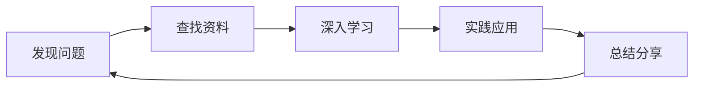

# 职业发展思考

::: info 文章信息
发布日期：2025年11月7日  
分类：工作 / 职业发展  
标签：#职业规划 #成长 #思考
:::

## 🎯 职业发展的重要性

> 职业生涯是一场马拉松，不是百米冲刺。

在快速变化的技术行业，如何规划自己的职业发展，是每个人都需要思考的问题。

## 📈 职业发展路径

### 技术路线

```
初级工程师
  ↓
中级工程师
  ↓
高级工程师
  ↓
技术专家/架构师
  ↓
首席架构师/技术总监
```

**特点**：
- 深耕技术领域
- 解决复杂技术问题
- 技术影响力
- 持续学习新技术

### 管理路线

```
初级工程师
  ↓
中级工程师
  ↓
技术负责人
  ↓
团队经理
  ↓
技术总监/CTO
```

**特点**：
- 团队管理
- 项目管理
- 战略规划
- 资源协调

### T 型人才

```
        广度
    ←─────────→
    
    技  某  技
    术  个  术
    A  领  C
       域
    深  的  
    度  深  
       度  
    ↓     ↓
```

**推荐路径**：
- 先纵向，深入一个领域
- 再横向，拓展相关技能
- 形成 T 型知识结构

## 💡 能力模型

### 技术能力

```markdown
## 技术能力金字塔

### 基础层
- 编程语言
- 数据结构与算法
- 操作系统
- 网络协议
- 数据库

### 应用层
- 框架和工具
- 系统设计
- 性能优化
- 安全防护
- 测试部署

### 架构层
- 架构设计
- 技术选型
- 系统拆分
- 性能调优
- 可扩展性
```

### 软技能

::: tip 同样重要的软技能

1. **沟通能力**
   - 清晰表达想法
   - 撰写技术文档
   - 演讲和分享

2. **团队协作**
   - 代码审查
   - 知识分享
   - 帮助他人

3. **项目管理**
   - 时间管理
   - 优先级排序
   - 风险控制

4. **问题解决**
   - 分析能力
   - 系统思维
   - 创新思维

5. **学习能力**
   - 快速学习
   - 知识沉淀
   - 持续成长
:::

## 🚀 不同阶段的重点

### 初级阶段（1-3年）

**目标**：打好基础，快速成长

```markdown
## 学习重点

### 技术基础
- [ ] 扎实掌握一门编程语言
- [ ] 理解基础数据结构和算法
- [ ] 熟悉开发工具和流程
- [ ] 学习主流框架

### 工作习惯
- [ ] 写清晰的代码
- [ ] 做好单元测试
- [ ] 学会使用版本控制
- [ ] 写技术文档

### 软技能
- [ ] 主动沟通
- [ ] 及时反馈
- [ ] 向前辈学习
- [ ] 参与团队活动
```

**建议**：
- 多写代码，多踩坑
- 不要怕问问题
- 主动承担任务
- 记录学习笔记

### 中级阶段（3-5年）

**目标**：独当一面，深度专精

```markdown
## 成长方向

### 技术深度
- [ ] 深入理解技术原理
- [ ] 能够设计中等复杂系统
- [ ] 性能优化经验
- [ ] 解决疑难问题

### 技术广度
- [ ] 了解前后端全栈
- [ ] 熟悉常见架构模式
- [ ] 掌握多种工具
- [ ] 关注技术趋势

### 影响力
- [ ] 技术分享和培训
- [ ] 参与开源项目
- [ ] 写技术博客
- [ ] 帮助团队成长
```

**建议**：
- 承担核心模块开发
- 参与技术方案设计
- 培养系统思维
- 建立技术影响力

### 高级阶段（5年+）

**目标**：技术专家或管理者

#### 技术专家方向

```markdown
## 技术专家要求

### 技术深度
- 某个领域的专家
- 解决复杂技术问题
- 技术决策和选型
- 技术趋势把握

### 影响力
- 团队技术导师
- 公司技术标准制定
- 行业技术影响力
- 开源贡献

### 业务理解
- 深入理解业务
- 技术与业务结合
- 技术驱动业务增长
```

#### 管理者方向

```markdown
## 管理者要求

### 团队管理
- 团队建设和培养
- 绩效管理
- 招聘和解雇
- 团队文化

### 项目管理
- 项目规划和执行
- 资源协调
- 风险管理
- 跨部门协作

### 战略规划
- 技术战略
- 团队规划
- 预算管理
- 业务推动
```

## 🔄 持续学习

### 学习方法



### 学习资源

```markdown
## 学习途径

### 官方文档
- 第一手资料，最权威

### 技术书籍
- 系统学习，深入理解

### 在线课程
- Coursera
- Udemy
- 极客时间

### 技术社区
- GitHub
- Stack Overflow
- 掘金/思否

### 技术会议
- QCon
- ArchSummit
- JSConf

### 开源项目
- 阅读源码
- 参与贡献
- 学习最佳实践
```

### 知识管理

::: tip 知识管理方法

**输入**：
- 阅读书籍和文章
- 观看技术视频
- 参加技术会议

**处理**：
- 做笔记和总结
- 建立知识体系
- 定期回顾

**输出**：
- 写博客文章
- 技术分享
- 参与讨论
- 实践项目
:::

## 💼 跳槽与选择

### 何时考虑跳槽？

```markdown
## 跳槽信号

⚠️ 考虑跳槽的情况：
- 长期没有成长空间
- 薪资明显低于市场水平
- 公司/团队文化不合适
- 学不到新东西
- 工作严重影响生活

✅ 可以再等等：
- 短期困难
- 正在负责重要项目
- 团队在成长期
- 有明确的成长计划
```

### 选择公司

```markdown
## 选择因素

### 成长空间 ⭐⭐⭐⭐⭐
- 技术栈是否先进？
- 能学到什么？
- 有导师带吗？
- 团队水平如何？

### 薪资待遇 ⭐⭐⭐⭐
- 薪资水平
- 股权激励
- 福利待遇
- 加班情况

### 公司前景 ⭐⭐⭐⭐
- 行业趋势
- 公司发展
- 产品竞争力
- 融资情况

### 工作环境 ⭐⭐⭐
- 办公环境
- 团队氛围
- 管理风格
- 工作地点
```

### 面试准备

```markdown
## 面试准备清单

### 技术准备
- [ ] 复习基础知识
- [ ] 刷算法题
- [ ] 整理项目经验
- [ ] 了解目标公司技术栈

### 简历优化
- [ ] 突出核心项目
- [ ] 量化工作成果
- [ ] 展示技术深度
- [ ] 简洁清晰

### 行为面试
- [ ] 准备常见问题
- [ ] STAR 法则讲故事
- [ ] 展示软技能
- [ ] 准备问题问面试官

### 薪资谈判
- [ ] 了解市场行情
- [ ] 知道自己的底线
- [ ] 不只看基本工资
- [ ] 综合考虑整体package
```

## 🎯 职业规划建议

### 1. 设定目标

```markdown
## SMART 目标

Specific（具体的）
Measurable（可衡量的）
Achievable（可实现的）
Relevant（相关的）
Time-bound（有时限的）

## 示例

❌ "我要变得更强"
✅ "2025 年读完 12 本技术书籍，写 24 篇博客"

❌ "学习新技术"
✅ "3 个月内掌握 Kubernetes，能独立部署项目"
```

### 2. 执行计划

```markdown
## 年度计划 → 季度目标 → 月度任务 → 周计划

### 2025 年目标
- 晋升高级工程师
- 完成 2 个核心项目
- 技术分享 12 次

### Q1 目标（1-3月）
- 学习系统设计
- 完成项目 A 核心模块
- 技术分享 3 次

### 1 月任务
- 阅读《系统设计面试》
- 完成项目 A 设计文档
- 准备技术分享主题

### 本周计划
- 周一至周三：项目开发
- 周四：技术分享
- 周五：学习和总结
```

### 3. 定期复盘

```markdown
## 月度复盘

### 这个月完成了什么？
- 完成功能 X
- 学习了技术 Y
- 写了 2 篇博客

### 遇到了什么困难？
- 问题 A：解决方案...
- 问题 B：仍在解决中

### 有什么收获和感悟？
- 学习心得...
- 工作感悟...

### 下个月计划
- 目标 1
- 目标 2
- 目标 3
```

## 💭 我的思考

### 关于技术

- 技术是手段，不是目的
- 不要为了技术而技术
- 解决问题比使用新技术重要
- 但要保持对新技术的关注

### 关于成长

- 成长需要时间，不要急躁
- 要主动走出舒适区
- 失败是成长的必经之路
- 保持好奇心和学习热情

### 关于选择

- 没有完美的选择
- 重要的是做出选择后努力
- 定期复盘，及时调整
- 相信自己的判断

## 📚 推荐阅读

### 职业发展
- 《软技能：代码之外的生存指南》
- 《程序员的职业素养》
- 《重来：更为简单有效的商业思维》

### 技术成长
- 《黑客与画家》
- 《代码大全》
- 《架构整洁之道》

## 🙏 总结

职业发展的关键：

- 🎯 **明确目标**：知道自己要什么
- 📚 **持续学习**：保持成长动力
- 💼 **积累经验**：在实践中成长
- 🤝 **建立人脉**：良师益友
- 🔄 **定期复盘**：及时调整方向

记住：

> 职业生涯是一场马拉松。
> 保持节奏，持续前进，终将到达理想的彼岸。

---

*Your career is a journey, not a destination.* 🚀

**你对自己的职业发展有什么规划？欢迎交流！**

