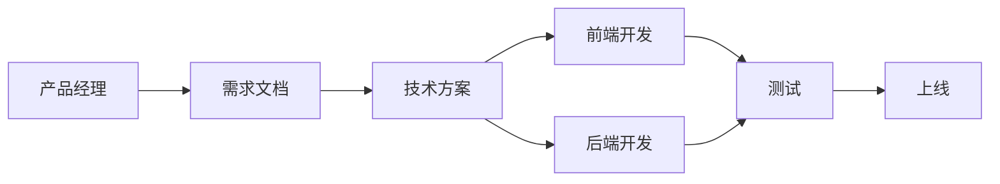

# 团队协作的艺术

::: info 文章信息
发布日期：2025年11月7日  
分类：工作 / 团队协作  
标签：#团队 #协作 #沟通
:::

## 🤝 为什么团队协作很重要？

> 单打独斗的时代已经过去，现代软件开发需要团队协作。

好的团队协作能够：
- 🚀 提高工作效率
- 💡 激发创新想法
- 📈 提升项目质量
- 😊 增强工作满意度
- 🎯 达成更大目标

## 💬 有效沟通

### 1. 主动沟通

::: tip 沟通原则
遇到问题？**先说出来！**

- ❌ 埋头苦干，最后发现方向错了
- ✅ 及时沟通，早发现早解决
:::

### 2. 清晰表达

使用**金字塔原理**：

```
结论先行
  ↓
以上统下
  ↓
归类分组
  ↓
逻辑递进
```

**示例**：

❌ **不好的表达：**
> "昨天我遇到了一个问题，然后我查了文档，又问了XXX，后来发现是配置问题..."

✅ **好的表达：**
> "问题已解决，是配置错误导致的。具体原因是...，以后可以这样避免..."

### 3. 主动反馈

```markdown
## 日常工作反馈

### 任务进度
- ✅ 已完成：用户登录功能
- 🔄 进行中：权限管理（80%）
- ⏰ 计划中：数据统计模块

### 遇到的问题
- 第三方 API 文档不全，需要技术支持

### 需要帮助
- 数据库性能优化，需要 DBA 支持

### 下一步计划
- 完成权限管理
- 开始数据统计模块设计
```

## 📋 协作工具

### 项目管理

**Jira / Asana / Trello**

```markdown
## 任务卡片模板

**标题**：[功能] 实现用户登录

**描述**：
实现基于 JWT 的用户登录功能

**验收标准**：
- [ ] 用户可以使用邮箱密码登录
- [ ] 登录成功返回 token
- [ ] token 有效期 24 小时
- [ ] 支持记住登录状态

**优先级**：P0
**预计时间**：2 天
**负责人**：@张三
**标签**：#后端 #认证
```

### 文档协作

**Notion / Confluence / 语雀**

```markdown
## 技术方案文档结构

1. 背景和目标
2. 现状分析
3. 解决方案
   - 方案A（推荐）
   - 方案B
   - 方案对比
4. 技术实现
5. 风险评估
6. 时间规划
7. 后续优化
```

### 即时通讯

**Slack / 钉钉 / 企业微信**

::: tip 沟通技巧
- 📝 重要信息用文字，避免纯语音
- 🎯 @相关人员，确保看到
- 📌 重要消息设置提醒
- 🕐 非紧急问题避免下班后打扰
:::

## 👥 团队分工

### 明确职责



### 合理分工

根据团队成员特点：

| 成员 | 擅长 | 负责 |
|------|------|------|
| 张三 | 后端架构 | 核心服务开发 |
| 李四 | 前端组件 | UI 组件库 |
| 王五 | 性能优化 | 系统优化 |
| 赵六 | 全栈 | 快速原型 |

### 知识共享

```markdown
## 知识分享活动

### 每周技术分享
- 时间：每周五下午
- 形式：30 分钟分享 + 讨论
- 主题：轮流负责

### 文档沉淀
- 项目文档
- 技术方案
- 问题记录
- 最佳实践

### 结对编程
- 新人培养
- 复杂功能
- 知识传递
```

## 🎯 高效会议

### 会议前

```markdown
## 会议准备清单

- [ ] 明确会议目标
- [ ] 准备会议议程
- [ ] 提前发送资料
- [ ] 确认参会人员
- [ ] 预定会议室/线上会议
```

### 会议中

::: tip 会议技巧
1. **准时开始，准时结束**
2. **有明确的主持人和记录人**
3. **聚焦议题，避免跑题**
4. **鼓励发言，但控制时间**
5. **总结决议和行动项**
:::

### 会议后

```markdown
## 会议纪要

**时间**：2025-11-07 14:00-15:00
**参会人员**：张三、李四、王五
**主题**：用户系统架构评审

### 讨论内容
1. 认证方案：采用 JWT
2. 数据库设计：User 表结构确认
3. API 设计：RESTful 风格

### 决议事项
- [x] 使用 JWT 认证（负责人：张三）
- [ ] 完成数据库设计（负责人：李四，11-10）
- [ ] 编写 API 文档（负责人：王五，11-12）

### 遗留问题
- 第三方登录方案待下次讨论
```

## 🔄 敏捷实践

### 站会（Daily Standup）

```
每天 10:00，15 分钟

每个人回答三个问题：
1. 昨天做了什么？
2. 今天计划做什么？
3. 遇到什么阻碍？
```

### 迭代评审（Sprint Review）

```markdown
## 迭代评审内容

### 已完成功能演示
- 功能 A：[演示]
- 功能 B：[演示]

### 数据指标
- 计划完成：10 个任务
- 实际完成：9 个任务
- 完成率：90%

### 经验总结
- 做得好的：...
- 需改进的：...

### 下个迭代计划
- 优先级最高的 3 件事
- 预计完成时间
```

### 回顾会议（Retrospective）

```
What went well? 什么做得好？
  ↓
What could be improved? 什么需要改进？
  ↓
Action items 改进计划
```

## 🚀 团队文化

### 1. 相互尊重

- 🙏 尊重他人的观点
- 💬 避免攻击性语言
- 🤝 建设性地提出批评
- 👂 认真倾听他人

### 2. 持续学习

```markdown
## 团队学习计划

### 技术分享
- 每周技术分享会
- 轮流担任讲师
- 分享新技术、项目经验

### 读书会
- 每月读一本书
- 分享读书笔记
- 讨论应用场景

### 代码审查
- 互相审查代码
- 学习优秀实践
- 提升代码质量
```

### 3. 透明开放

- 📊 项目进度透明
- 💡 问题公开讨论
- 🎯 目标清晰明确
- 📈 数据开放共享

### 4. 快速反馈

```
发现问题
  ↓
立即沟通（不超过1小时）
  ↓
快速解决
  ↓
复盘总结
```

## 💡 协作技巧

### 1. 主动帮助

```markdown
## 如何提供帮助

看到同事遇到困难：

❌ "这么简单都不会？"
✅ "需要帮忙吗？我之前遇到过类似问题"

❌ "你应该这样做..."
✅ "我有个想法，我们可以试试..."

❌ 直接给答案
✅ 引导思考，一起解决
```

### 2. 处理分歧

```
出现分歧时：

1. 理解对方观点
   "你是说...对吗？"

2. 陈述自己观点
   "我的考虑是..."

3. 寻找共识
   "我们都同意...对吧？"

4. 数据和事实说话
   "我们可以看看数据/测试结果"

5. 必要时寻求第三方意见
```

### 3. 远程协作

::: tip 远程工作最佳实践

- 📹 **开视频**：增加参与感
- 🎤 **麦克风**：确保音质清晰
- 💬 **文字记录**：重要内容写下来
- 📅 **时区意识**：考虑不同时区
- ⏰ **响应时效**：及时回复消息
- 🏠 **工作环境**：安静的工作空间
:::

## 📈 团队效能

### 衡量指标

```markdown
## 团队健康度指标

### 交付效率
- 迭代完成率
- 缺陷修复时间
- 代码审查时效

### 代码质量
- 测试覆盖率
- 代码审查通过率
- 生产环境问题数

### 团队氛围
- 成员满意度
- 离职率
- 知识分享频率

### 持续改进
- 流程优化次数
- 工具改进
- 技能提升
```

### 改进方向

```
发现瓶颈
  ↓
分析原因
  ↓
提出方案
  ↓
小步试验
  ↓
评估效果
  ↓
推广或调整
```

## 🎯 我的实践经验

### 1. 建立信任

- 说到做到，建立信誉
- 主动分享，不藏私
- 承认错误，快速改正
- 相互支持，共同成长

### 2. 高效沟通

- 重要的事情说三遍
- 复杂的事情写文档
- 紧急的事情当面说
- 例行的事情定时间

### 3. 解决冲突

- 对事不对人
- 理解他人立场
- 寻求双赢方案
- 必要时妥协

## 📚 推荐资源

### 书籍
- 《高效团队的秘密》
- 《非暴力沟通》
- 《关键对话》
- 《团队协作的五大障碍》

### 工具
- Slack / 钉钉（即时通讯）
- Jira / Trello（项目管理）
- Notion / Confluence（文档）
- Figma（设计协作）

## 🙏 总结

好的团队协作需要：

- 💬 **有效沟通**：清晰、及时、透明
- 🤝 **相互信任**：尊重、支持、理解
- 📋 **明确分工**：职责清晰、配合默契
- 🔄 **持续改进**：反思、优化、成长

记住：

> 一个人可以走得很快，一群人可以走得更远。

让我们一起打造高效协作的优秀团队！

---

*Alone we can do so little; together we can do so much.* 🤝

